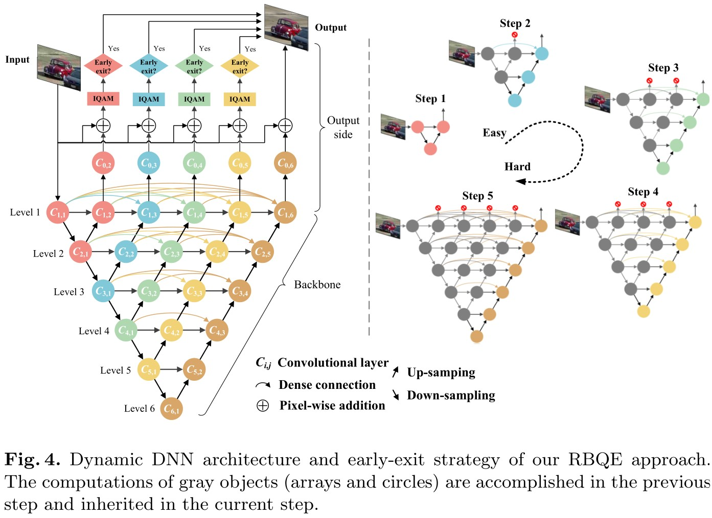
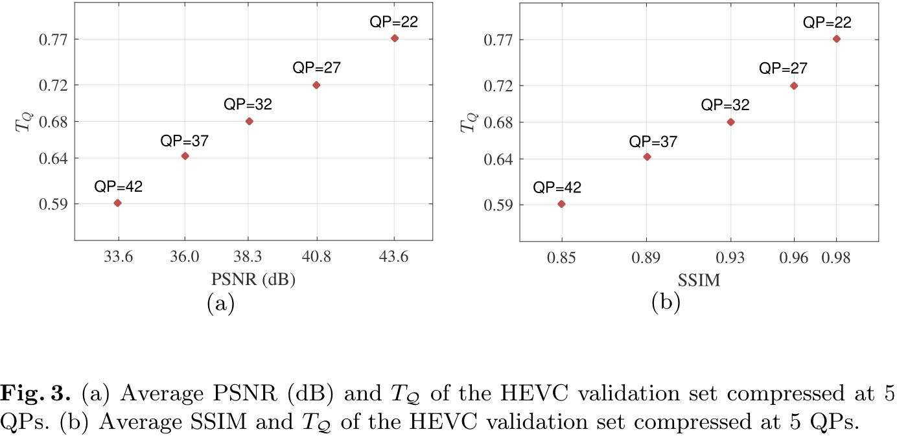
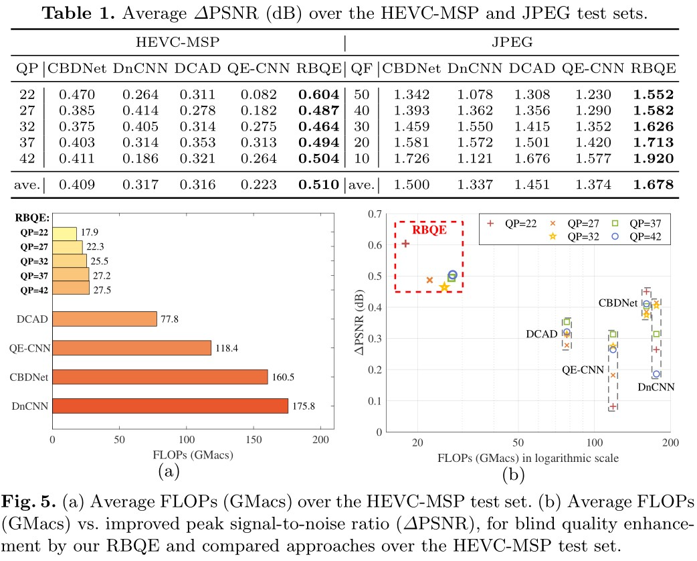
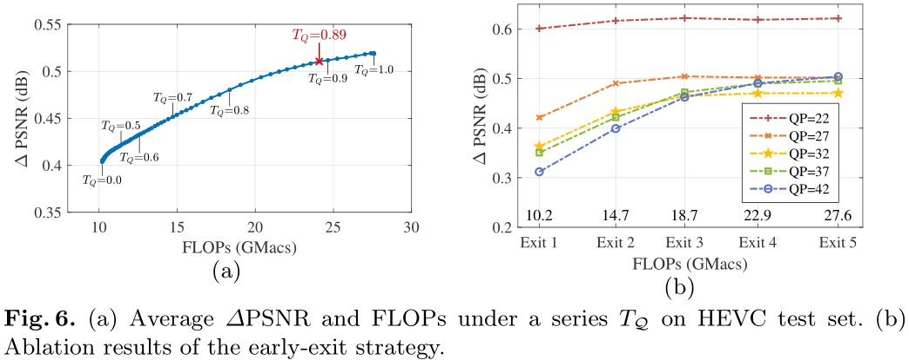

# 论文速览：*Early Exit or Not: Resource-Efficient Blind Quality Enhancement for Compressed Images* (ECCV 2020)

[[项目主页]](https://github.com/ryanxingql/rbqe) [[论文]](https://arxiv.org/abs/2006.16581)

## 目录

- [论文速览：*Early Exit or Not: Resource-Efficient Blind Quality Enhancement for Compressed Images* (ECCV 2020)](#论文速览early-exit-or-not-resource-efficient-blind-quality-enhancement-for-compressed-images-eccv-2020)
  - [目录](#目录)
  - [1. 初衷](#1-初衷)
  - [2. 思路演化](#2-思路演化)
  - [3. 网络设计和训练方法](#3-网络设计和训练方法)
  - [4. 质量判别](#4-质量判别)
  - [5. 实验](#5-实验)
  - [6. 我和这篇工作](#6-我和这篇工作)

## 1. 初衷

在 19 年 [MFQEv2](https://github.com/ryanxingql/mfqev2.0) 的工作中，我们要针对不同失真类型的压缩视频，训练同一结构、不同参数的深度网络模型。例如，对于 HEVC 压缩的 5 种典型配置（固定 QP 为 22、27、32、37、42 编码），我们需要训练 5 个深度网络模型。

这种训练思路会导致两个实际问题：

- 资源浪费：特别是当输入视频失真类型差异较大时（例如用户上传的各式各样的 UGC），所需模型种类较多。
- 非盲增强：由于每一个模型都对应一种特定的失真，因此我们必须提前知悉输入视频的失真类型（例如 QP 信息），再匹配模型；而实际场景中存在大量失真内容/失真程度未知的压缩视频。

那么，能否使用单一模型、对付多种失真视频？具体而言，能否设计一种网络，能够判断自动失真类型，然后健壮地增强各式各样的失真视频（盲处理）？

## 2. 思路演化

为了简化问题，我们先在压缩图像上实现我们的构思。

上面提到的思路（先分类，再增强）本质上属于“伪盲”：我们只能限定若干种失真类型，然后再对输入图像进行判别，最后再将输入图像送入对应的增强支路。采用这种思路的 [paper](https://ieeexplore.ieee.org/abstract/document/8653951/) 已经有了，和非盲增强的框架相比，只是多了一个 QP 分类器，并无新意。

此时我有了新的思路：设计一种渐进增强的网络，并且在增强的过程中，对**已增强图像**的质量进行判断；如果质量合格，那么就提前退出。这样做有几点好处：

- 做到了真正的盲增强：无需限定可处理的失真类型。
- 更符合实际需求：已增强图像需要达到既定目标才能输出。现实中我们往往也是对图像的质量有所要求。
- 快速，节能：由于存在提前退出机制，因此简单图像可以简单增强。

但这么做带来了全新的挑战：

- 如何设计高效的渐进盲增强网络？
- 如何判别图像质量？

我来详细说说。

## 3. 网络设计和训练方法

我很快联想到了大量网络剪裁、网络加速的相关工作。在图像分类任务中比较典型的有 [MSDNet](https://arxiv.org/abs/1703.09844) 和 [SkipNet](https://openaccess.thecvf.com/content_ECCV_2018/html/Xin_Wang_SkipNet_Learning_Dynamic_ECCV_2018_paper.html)。两个工作有一点明显的区别（对我而言需要选择其中一种思路加以改进）：

- MSDNet 对 tradeoff 的决策只在测试阶段阈值的选择。
  - MSDNet 在训练过程中不区分难易样本，而是简单地执行深监督（所有样本在所有出口的 loss 权重都是 1，然后求和）。
  - 在测试阶段，作者需要设置一个输出阈值，当某出口的分类阈值达到既定阈值时，即可在当前出口输出。
  - 训练简单，阈值设置主观。
- SkipNet 在设计训练 loss 时需要考虑 tradefoff。
  - SkipNet 在训练分类网络的同时，还训练一个基于 RL 的 skip 与否判别器；训练的 loss 不仅包括分类准确率，还包括消耗资源的度量。
  - 训练复杂，loss 设计主观。

为快速实现压缩图像盲增强的第一个工作，我决定采用思路 1，并给出了如下网络设计，如图：

有几点说明：

- 对于分类任务，分类器输出值经过归一化后，可以作为置信度，与阈值进行比较；然而对于质量增强任务，增强网络无法提供质量测度；因此我们额外需要一个质量评估模块，见下一节。
- 难、易图像的增强，在前处理阶段可以共享，我们称之为“编码”；而在后处理阶段，即所谓的“解码”时，我们最好给难、易样本提供各自的处理支路，让网络更好地处理差异。因此在整体上，我采用了如图所示的嵌套 U-Net 结构：其编码主干（也就是下采样的主干）是渐进共享的，而解码支路（也就是上采样的 5 个支路）各走各的。
- 在此基础上，我增加了稠密连接，来进一步降低资源消耗：支路之间的连接强度是可学习的，因此引入稠密连接利大于弊。
- 由于衡量能耗的指标选为 FLOPs，为进一步降低 FLOPs，整体网络大量使用 separable convolution；虽然 FLOPs 表现很优异，但耗时上表现一般（和对比算法相比）。

RBQE 的训练方法和 MSDNet 的基本是一致的。不同的是，我在训练阶段也稍微考虑了图像的难易。例如，对于高 QP（低质量）的样本，我鼓励它深度增强（后退出），因此其 loss 在深出口的权重要更大（对网络后端的改善会更明显）；反之，对于低 QP（高质量）的样本，我鼓励它简单增强（先退出），因此其 loss 在浅出口的权重要更大（迫使网络在较浅时即可达到较好的增强效果）。

遗憾的是，尽管我们不需要明确指出失真类型（参考我前面批评伪盲增强的部分），但训练时仍必须制备若干种类型的失真图像，然后才能为它们分配在不同出口的 loss 权重。而且出口权重的设置也是主观的。

## 4. 质量判别

在 [MFQEv2](https://github.com/ryanxingql/mfqev2.0) 和相关工作中，PSNR 和 SSIM 是主要的质量评价指标，因此本文也沿用了该指标（实际上，我最近也在研究感知质量指标，因为感知质量更贴合实际需求）。

比较困难的一点是：PSNR 是 FR IQA 指标，而 RBQE 是无参考的盲增强方法，无法获取参考图像。这就要求，我们的质量评估方法在压缩图像上的趋势，应尽可能逼近 PSNR 和 SSIM。

具体的 IQA 设计见论文，思路：

1. 我们对压缩图像中的模糊和块效应都比较敏感，特别是发生在平滑区域的块效应，以及发生在纹理区域的模糊。
2. 那么，我们对图像分块，然后逐块执行二分类：平滑块或是纹理块。
3. 对于平滑块，我们评估块效应强度，具体指标是切比雪夫矩中的特定方向能量；对于纹理块，我们评估模糊强度，具体方法是对当前块进行二次模糊，比较前后的矩相似性；如果相似性高，说明原本块就很模糊。
4. 最后，我们二者进行归一化和加权组合。由于我们对前者更加敏感。因此前者权重较大。

虽然该盲 IQA 模块需要设置一定数量的超参数，但经过我在 QP 等于 22、27、32、37、42 的图像上实验后发现，IQA 输出结果和 PSNR、SSIM 趋势相同；因此我认为该 NR IQA 模块理想地完成了盲质量评估的既定目标：

## 5. 实验

无论是以 PSNR 和 SSIM 为指标的质量增强，还是以 FLOPs 为指标的资源节约，上述方法在 HEVC 压缩图像以及 JPEG 压缩图像上都取得了较好的效果，如图：

进一步我想考察，RBQE 究竟是否达到了 tradeoff 意义上的最优。首先，在输出阈值的选择上，我们根据下图左的结果，选择了拐点（在实际场景中应根据条件和需求确定）。

在右图中，我们迫使 HEVC 压制的每一种 QP 的图像，分别从 5 个出口都输出，并测量其 PSNR 结果。例如对于 QP 等于 27 的图像，我们能明显看到，其在出口 2 输出是最为理想的；当在出口 3、4、5 输出时，PSNR 无法获得明显提升，而能耗稳定增加。

综上，在当前的训练策略下，RBQE 的盲增强性能和节能情况均能超越对比算法，并且实现了既定的 tradeoff 思想。RBQE 作为相关领域的第一篇工作，训练方法简单，思路清晰；但我认为 RBQE 还有较大的缺憾，还希望在今后的工作中加以讨论和改善。主要有几个方面：

1. 改进训练方法，使得难易样本的训练更和谐统一。
2. 更好地刻画难易样本（不能简单地根据图像的压缩 QP，而应根据网络增强情况或实际需求）。
3. 考虑如何在盲增强中尽可能剔除主观设计因素。这一点尤为困难，因为我们既想发挥深度网络的性能优势，又想摒弃深度网络的“死板”（深度网络有时不如传统方法健壮和自适应，即测试数据必须和训练数据类型匹配）。
4. 考虑其他更实际的质量评估指标，来代替 PSNR 和 SSIM；相应地，质量评估方法也要有所变化。

欢迎关注、讨论以及改善 RBQE 方法！

## 6. 我和这篇工作

2019 年 CVPR 前几个月，我对新课题一筹莫展。徐迈老师给我布置的课题是多任务；我做了一段时间的调研，没有太大进展。多任务的确非常好发论文：很多任务理论上都是关联的，因而协同训练往往是互有增益的。然而，我更希望在理论上有所突破；这一点对我有点困难。

2019 年 9 月，MSDNet 作者（也是 DenseNet 作者）黄高老师受邀给我们做学术报告，主题为动态网络。这个报告瞬间给我了一剂强心剂：我之前苦苦思索的 MFQE 多模型之痛，可以通过单一动态模型加以解决！

之后的心路历程就如上文所示了：不断遭遇新问题、寻求解方、实验验证。在整体框架出结果之前，我也给实验室做了许多次报告，包括动态网络、多任务等等。当我最终完成了所有实验探索后，时间也来到了 CVPR 前最后两个月。在此期间，徐老师对我的工作非常有信心；我们也来回修改了 8 个版本之多。

可惜的是，CVPR 的审稿意见并不如意；审稿人 2、3 在经过 rebuttal 后都改变了意见，而审稿人 1 始终觉得文章新意不够。我自我反思：我把我在方法演进过程中最困难的部分，例如嵌入的质量评估模块，因页数限制放到了补充材料里；而审稿人大多没有时间阅读补充材料。

经历了 CVPR 的惨痛教训，我决心大改文章；从 introduction 改起，重点把自己攻克的难关，完完整整地呈现给审稿人。因此在接下来的 ECCV 中，RBQE 方法获得了一致 5 分（满分为 6 分），顺利接收。

这篇文章是我从选题、背景调研、实验和写作完全独立的一次尝试，让我对动态网络有了全新的认识，也算是开启了增强领域的一个小分支。这篇工作还没有结束；我还在努力尝试从理论上改进、提升它。
